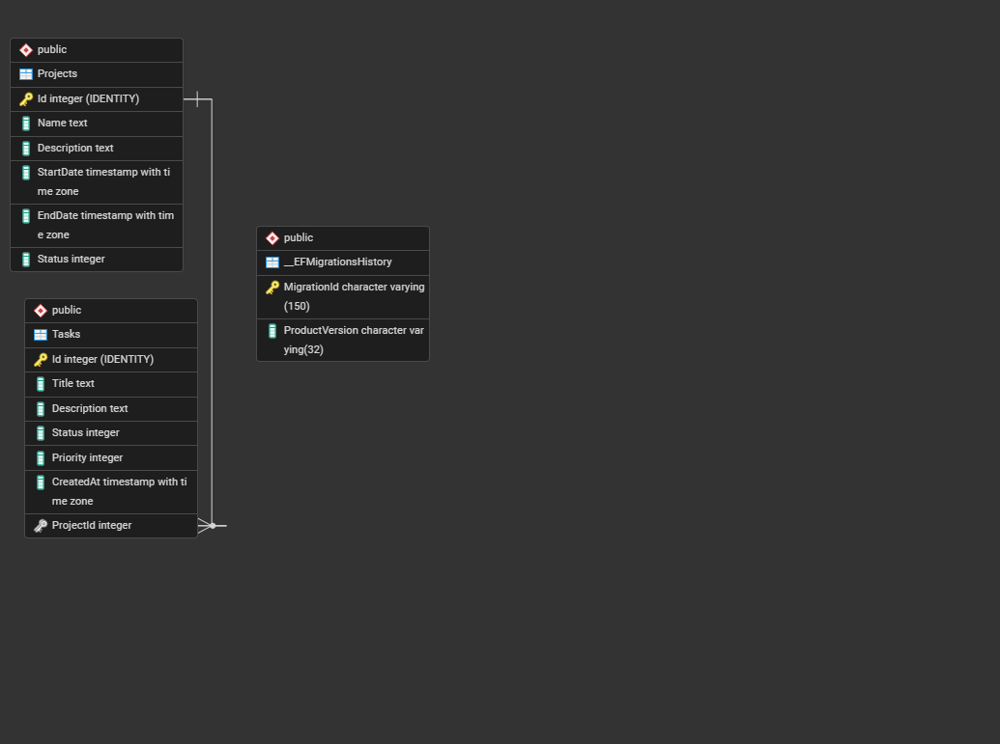

# Task Manager
 
Aplicación para gestionar proyectos y las tareas que pertenecen a cada uno. La hice como prueba técnica para IDEASGROUP. El backend es una API REST en .NET 8 con PostgreSQL, y el frontend está en Angular 17.
 
**Autor:** Bixmarck Rodríguez
**Repositorio:** https://github.com/itsThest/TaskManager
 
---
 
## Índice
 
1. [Qué usé](#qué-usé)
2. [Cómo está organizado el repositorio](#cómo-está-organizado-el-repositorio)
3. [Modelo de datos](#modelo-de-datos)
4. [Cómo levantar el proyecto](#cómo-levantar-el-proyecto)
5. [Variables de entorno](#variables-de-entorno)
6. [Endpoints](#endpoints)
7. [Decisiones que tomé y por qué](#decisiones-que-tomé-y-por-qué)
8. [Pruebas](#pruebas)
9. [Lo que quedó fuera](#lo-que-quedó-fuera)
10. [Uso de inteligencia artificial](#uso-de-inteligencia-artificial)
---
 
## Qué usé
 
- **Backend:** .NET 8, C#, ASP.NET Core Web API
- **Base de datos:** PostgreSQL 16 con Entity Framework Core 8 y migraciones
- **Frontend:** Angular 17 con componentes standalone, TypeScript, SCSS
- **Librería de UI:** Angular Material 17
- **Pruebas:** xUnit y Moq en el backend, Jasmine y Karma en el frontend
---
 
## Cómo está organizado el repositorio
 
Todo está en un solo repositorio, como pide el enunciado:
 
```
TaskManager/
├── task-manager-backend/          La API
│   ├── Controllers/               Reciben las peticiones HTTP
│   ├── Services/                  La lógica de negocio
│   ├── Repositories/              Todo lo que toca la base de datos
│   ├── Models/                    Las entidades Project y TaskItem
│   ├── DTOs/                      Lo que entra y sale de la API
│   ├── Data/                      El DbContext
│   └── Migrations/                Las migraciones de EF Core
├── task-manager-backend.Tests/    Pruebas unitarias del backend
├── task-manager-frontend/         La app de Angular
│   └── src/app/
│       ├── core/                  Modelos y servicios HTTP
│       └── features/              Los componentes, agrupados por dominio
└── Docs/                          El diagrama de la base de datos
```
 
En el backend las tres capas se comunican solo hacia abajo y siempre a través de interfaces:
 
```
Controller  →  Service  →  Repository  →  DbContext  →  PostgreSQL
```
 
El controller no sabe nada de Entity Framework y el service tampoco. El único sitio donde aparece el `DbContext` es en los repositorios.
 
---
 
## Modelo de datos
 

 
Son dos tablas. Un proyecto puede tener muchas tareas y cada tarea pertenece a un solo proyecto, así que la relación es uno a muchos con la clave foránea `ProjectId` en `Tasks`.
 
El enunciado no decía qué valores debían tener los estados, así que los definí yo:
 
| Campo | Valores |
|---|---|
| Estado del proyecto | Planned (0), InProgress (1), Completed (2), Cancelled (3) |
| Estado de la tarea | Pending (0), InProgress (1), Done (2) |
| Prioridad de la tarea | Low (0), Medium (1), High (2) |
 
Se guardan como enteros en la base de datos. La API los devuelve como número y el frontend los traduce a texto para mostrarlos.
 
---
 
## Cómo levantar el proyecto
 
> Desarrollé el backend en Visual Studio Community 2022 y el frontend en Visual Studio Code. Las instrucciones de abajo son todas por línea de comandos para que funcionen en cualquier entorno, sin depender de un IDE concreto. Desde Visual Studio la API también se puede levantar con F5, y las migraciones se manejan con `Add-Migration` y `Update-Database` desde la Consola del Administrador de paquetes, que es como las fui creando yo.
 
### Lo que hace falta tener instalado
 
- .NET 8 SDK
- Node.js 18 o superior
- PostgreSQL 16
- Angular CLI: `npm install -g @angular/cli`
### 1. Clonar
 
```bash
git clone https://github.com/itsThest/TaskManager.git
cd TaskManager
```
 
### 2. Crear la base de datos vacía
 
Las migraciones crean las tablas, pero no la base de datos que las contiene. Esa hay que crearla antes:
 
```sql
CREATE DATABASE taskmanager;
```
 
No hay que ejecutar ningún script de tablas. Todo lo demás lo hacen las migraciones.
 
### 3. Definir la variable de entorno
 
La cadena de conexión no está en el repositorio porque lleva la contraseña de la base de datos. Hay que definirla como variable de entorno antes de levantar la API. Está explicada en la [sección siguiente](#variables-de-entorno).
 
### 4. Levantar la API
 
```bash
cd task-manager-backend
dotnet restore
 
# La herramienta de EF Core no viene incluida en el SDK, hay que instalarla una vez.
# Va fijada a la versión 8 porque el proyecto apunta a .NET 8.
dotnet tool install --global dotnet-ef --version 8.*
 
dotnet ef database update
dotnet run
```
 
Si ya tienes `dotnet-ef` instalado en otra versión, el comando de instalación avisará de que la herramienta ya existe. En ese caso, usa `dotnet tool update --global dotnet-ef --version 8.*`.
 
`dotnet ef database update` aplica las dos migraciones en orden y deja la base lista.
 
La API queda en `https://localhost:7072` y Swagger en `https://localhost:7072/swagger`.
 
### 5. Levantar el frontend
 
En otra terminal, con la API corriendo:
 
```bash
cd task-manager-frontend
npm install
ng serve
```
 
Queda en `http://localhost:4200`.
 
> Un detalle que me pasó: si el navegador no confía en el certificado de desarrollo de .NET, las peticiones desde Angular fallan con un error de red que no dice mucho. Se arregla abriendo `https://localhost:7072/swagger` una vez y aceptando la advertencia de seguridad.
 
### 6. Correr las pruebas
 
```bash
# Backend
cd task-manager-backend.Tests
dotnet test
 
# Frontend
cd task-manager-frontend
ng test
```
 
---
 
## Variables de entorno
 
### Backend
 
Solo hace falta una:
 
| Variable | Valor |
|---|---|
| `ConnectionStrings__DefaultConnection` | `Host=localhost;Port=5432;Database=taskmanager;Username=postgres;Password=TU_CONTRASEÑA` |
 
En Windows, desde PowerShell (queda guardada para el usuario):
 
```powershell
[Environment]::SetEnvironmentVariable("ConnectionStrings__DefaultConnection", "Host=localhost;Port=5432;Database=taskmanager;Username=postgres;Password=TU_CONTRASEÑA", "User")
```
 
En Linux o macOS:
 
```bash
export ConnectionStrings__DefaultConnection="Host=localhost;Port=5432;Database=taskmanager;Username=postgres;Password=TU_CONTRASEÑA"
```
 
El doble guion bajo no es un capricho: es la forma que tiene .NET de representar la jerarquía `ConnectionStrings:DefaultConnection` dentro de una variable de entorno. Gracias a eso, en el código se lee igual que si estuviera en `appsettings.json`:
 
```csharp
builder.Configuration.GetConnectionString("DefaultConnection")
```
 
Si la defines en Windows, hay que reiniciar el IDE o la terminal, porque los procesos leen las variables de entorno solo al arrancar.
 
### Frontend
 
La URL de la API está en los archivos de entorno, no escrita dentro de los servicios:
 
- `src/environments/environment.ts` — producción
- `src/environments/environment.development.ts` — desarrollo
```typescript
export const environment = {
  apiUrl: 'https://localhost:7072/api'
};
```
 
Angular reemplaza el archivo automáticamente según con qué configuración compiles. En el código siempre se importa `environment.ts` y nunca el de desarrollo directamente.
 
Para desplegar en otro servidor bastaría con cambiar `apiUrl` en el de producción, sin tocar código.
 
---
 
## Endpoints
 
| Método | Ruta | Respuestas |
|---|---|---|
| GET | `/api/projects?page&pageSize&name` | 200 |
| GET | `/api/projects/{id}` | 200, 404 |
| POST | `/api/projects` | 201, 400 |
| PUT | `/api/projects/{id}` | 204, 404 |
| DELETE | `/api/projects/{id}` | 204, 404, **409** |
| GET | `/api/projects/{projectId}/tasks?page&pageSize` | 200 |
| GET | `/api/tasks/{id}` | 200, 404 |
| POST | `/api/tasks` | 201, 404 |
| PUT | `/api/tasks/{id}` | 204, 404 |
| DELETE | `/api/tasks/{id}` | 204, 404 |
 
Los dos listados devuelven la misma forma:
 
```json
{
  "items": [],
  "totalCount": 0,
  "page": 1,
  "pageSize": 10
}
```
 
El 409 del DELETE de proyectos es la regla de negocio: no se puede borrar un proyecto que tenga tareas.
 
---
 
## Decisiones que tomé y por qué
 
### Un solo proyecto de backend en vez de varios
 
El enunciado pide separación Controller / Service / Repository. Lo resolví con carpetas por capa dentro de un mismo proyecto, comunicadas por interfaces e inyección de dependencias.
 
Estuve evaluando la otra opción, que era partirlo en cuatro proyectos separados (Core, Repository, Service, API). Esa alternativa tiene una ventaja concreta: si `API` no referencia a `Repository`, el `DbContext` ni siquiera es visible desde un controller, así que el compilador te impide saltarte una capa. Con carpetas, eso depende de la disciplina de uno.
 
La descarté por alcance. Son cuatro `.csproj`, referencias entre ellos, los paquetes NuGet repartidos y los comandos de migración pidiendo `--startup-project` y `--project`. Para un proyecto de este tamaño, y con el tiempo que tenía, no compensaba.
 
Lo que sí me importaba era que el desacoplamiento fuera real y no solo estético, y eso se puede comprobar: en las pruebas unitarias reemplazo el repositorio por un mock y el servicio funciona igual, sin base de datos de por medio. Si el servicio dependiera del `DbContext` directamente, ese test no se podría escribir.
 
### Controllers en lugar de Minimal APIs
 
Porque el enunciado habla explícitamente de una capa "Controller" y así el mapeo es directo.
 
### DTOs separados de las entidades
 
Los controllers nunca devuelven las entidades. Al principio pensé que era un paso de más, pero hay tres razones concretas:
 
1. `Project` tiene una colección de `Tasks` y cada `TaskItem` tiene una referencia a su `Project`. Al serializar eso a JSON se entra en un ciclo infinito.
2. Si el POST aceptara un `Project`, el cliente podría mandar un `Id` o una lista entera de tareas. Con un DTO solo existen los campos que yo decido.
3. Si mañana cambio el nombre de una columna, no rompo el contrato con el frontend.
Los hice con `record` posicionales porque un DTO es un contenedor de datos que no cambia una vez creado, y `record` genera el constructor y las propiedades inmutables en una línea. Con una clase habría funcionado igual, pero con más código y permitiendo mutación que no necesito.
 
El mapeo entre entidad y DTO lo hago a mano con un método `ToDto`. Para dos entidades me pareció más claro que meter AutoMapper y una dependencia más.
 
### Paginación y filtro resueltos en la base de datos
 
Esto está en el repositorio de proyectos:
 
```csharp
var query = _context.Projects.AsNoTracking().AsQueryable();
 
if (!string.IsNullOrWhiteSpace(name))
    query = query.Where(p => EF.Functions.ILike(p.Name, $"%{name}%"));
 
var totalCount = await query.CountAsync();
 
var items = await query
    .OrderBy(p => p.Id)
    .Skip((page - 1) * pageSize)
    .Take(pageSize)
    .ToListAsync();
```
 
Cosas que decidí ahí:
 
**`ILike` en vez de `Contains`.** Es de PostgreSQL y hace la búsqueda parcial sin distinguir mayúsculas, así que "big" encuentra "BigData". La opción portable sería `p.Name.ToLower().Contains(name.ToLower())`, que funciona en cualquier motor pero impide aprovechar índices. Como el enunciado ya fija PostgreSQL, asumí el acoplamiento a cambio de mejor rendimiento.
 
**El conteo va después del filtro y antes de paginar.** Si contara antes del `Where`, el total sería el de toda la tabla y el paginador del frontend mostraría páginas que no existen.
 
**El `OrderBy` no es opcional.** Sin un orden explícito, la base de datos no garantiza que las filas salgan siempre igual, y un mismo registro podría aparecer en la página 1 y en la 2. Es un error de paginación bastante típico.
 
**`AsNoTracking()` solo en las lecturas.** Por defecto EF guarda una copia de cada entidad para detectar cambios, y en una consulta que solo se convierte a JSON eso es trabajo desperdiciado. En `GetByIdAsync` lo dejé sin poner a propósito, porque esa entidad puede terminar modificándose en un update.
 
En el servicio valido los parámetros corrigiéndolos en lugar de rechazarlos: si llega `page = 0` lo paso a 1, y `pageSize` lo limito a 100. Sin eso, `(0 - 1) * pageSize` daría un `Skip` negativo y EF lanzaría una excepción. Se podría devolver un 400 en su lugar, que es más estricto, pero me pareció peor experiencia para quien consume la API.
 
### La regla de no borrar proyectos con tareas
 
Está en el servicio, que es donde va la lógica de negocio:
 
```csharp
public async Task<DeleteResult> DeleteAsync(int id)
{
    var project = await _repository.GetByIdAsync(id);
    if (project is null) return DeleteResult.NotFound;
 
    if (await _repository.HasTasksAsync(id))
        return DeleteResult.HasTasks;
 
    await _repository.DeleteAsync(project);
    return DeleteResult.Success;
}
```
 
Devuelve un enum `DeleteResult` con tres valores en vez de un `bool`. Lo hice así porque el controller tiene que distinguir tres situaciones distintas para devolver 204, 404 o 409, y con un booleano no se puede diferenciar "no existe" de "tiene tareas". También pensé en lanzar una excepción, pero descarté la idea: esto no es un fallo del sistema, es un resultado previsto del flujo normal, y usar excepciones para eso sale caro y confunde la lectura.
 
`HasTasksAsync` usa `AnyAsync`, que se traduce a un `EXISTS` en SQL y se detiene en cuanto encuentra una fila. Con `Count() > 0` recorrería todas para nada.
 
Un detalle que me parece importante: la clave foránea quedó con el borrado en cascada que EF pone por defecto, así que a nivel de base de datos borrar un proyecto sí arrastraría sus tareas. Pero eso nunca llega a ejecutarse, porque el servicio rechaza la operación antes. La regla vive en la capa de negocio y no delegada al motor de base de datos, que es donde creo que debe estar.
 
En el frontend el componente mira específicamente el código 409 para mostrar el motivo real:
 
```typescript
const message = err.status === 409
  ? 'No se puede eliminar un proyecto que tiene tareas asociadas.'
  : 'No se pudo eliminar el proyecto.';
```
 
Sin ese `if`, el usuario vería un "algo salió mal" genérico y no entendería por qué.
 
### Las rutas de tareas
 
El listado es `GET /api/projects/{projectId}/tasks`, anidado, porque las tareas solo tienen sentido dentro de un proyecto y así la URL lo expresa. La alternativa era `GET /api/tasks?projectId=5`, que también es válida y sería más flexible si hubiera que combinar varios filtros. Me quedé con la anidada porque describe mejor el modelo.
 
Como el controller de tareas maneja dos formas de ruta distintas (`/api/projects/{id}/tasks` y `/api/tasks/{id}`), no comparten prefijo y por eso ahí no usé `[Route("api/[controller]")]` sino la ruta completa en cada método.
 
### Frontend: los componentes no llaman a HttpClient
 
Toda la comunicación pasa por `ProjectService` y `TaskService`. Son los únicos que conocen las URLs y los verbos HTTP; los componentes solo se ocupan de mostrar y de su propio estado.
 
Los parámetros de la query los armo con `HttpParams` en lugar de concatenar strings, porque codifica bien los valores. Si alguien busca un nombre con espacios o con un `&`, concatenando se rompería la URL.
 
En cada llamada manejo `loading` y `error` de forma explícita, y apago el `loading` en las dos ramas de la suscripción. La primera vez lo puse solo en el `next` y me di cuenta de que si la petición fallaba el spinner se quedaba girando para siempre.
 
### Un componente de formulario para crear y para editar
 
`ProjectFormComponent` funciona en los dos modos según haya o no un `id` en la ruta: si lo hay, carga el proyecto y hace PUT; si no, hace POST. Igual con las tareas.
 
Podría haber hecho dos componentes, pero el formulario, las validaciones y el maquetado habrían sido idénticos, y la única diferencia real es a qué método del servicio se llama.
 
Usé formularios reactivos en vez de `ngModel` porque las validaciones quedan declaradas en TypeScript y son testeables. En el buscador del listado sí usé `ngModel`, porque es un solo input sin validación y no compensaba montar un `FormGroup`.
 
Una cosa que tuve que corregir: cuando el formulario es inválido llamo a `markAllAsTouched()`. Material solo muestra los mensajes de error en los campos que el usuario ha "tocado", así que sin esa línea, al pulsar Guardar con el formulario vacío no pasaba nada y no se veía ningún mensaje.
 
### Angular Material
 
Lo usé porque me daba la tabla, el paginador, los formularios y las notificaciones ya hechos. El enunciado dice que el diseño visual no se evalúa, así que preferí gastar el tiempo en la funcionalidad. El paginador fue lo que más trabajo me ahorró.
 
### Detalles menores que también decidí
 
- Llamé a la entidad `TaskItem` y al enum `TaskItemStatus` en lugar de `Task` y `TaskStatus`, porque .NET 8 importa `System.Threading.Tasks` de forma implícita y habría colisión de nombres con `Task` y `TaskStatus`.
- Fijé el `RootNamespace` a `TaskManagerBackend` en el `.csproj`, porque el nombre de carpeta con guiones hacía que Visual Studio generara `task_manager_backend`, que no sigue la convención PascalCase de .NET.
- Los paquetes de EF Core están fijados a la versión 8.0.10 a propósito. Tengo instalado el SDK de .NET 10 y si dejo que NuGet instale la última, arrastra dependencias que piden un runtime superior al que apunta el proyecto.
- CORS está restringido a `http://localhost:4200` en lugar de usar `AllowAnyOrigin()`. En producción esa URL debería salir de configuración y no estar escrita en el código.
---
 
## Pruebas
 
### Backend: 4 pruebas con xUnit y Moq
 
Van todas sobre `ProjectService`, que es donde está la lógica que de verdad puede romperse:
 
- Borrar un proyecto que tiene tareas devuelve `HasTasks`
- Borrar uno sin tareas lo elimina y devuelve `Success`
- Borrar uno que no existe devuelve `NotFound`
- Pedir `page = 0` y `pageSize = 500` se corrige a `page = 1` y `pageSize = 100`
La primera es la que más me gusta, porque además de comprobar el valor devuelto verifica con `Times.Never` que el método de borrado del repositorio no se llegó a llamar. No basta con que devuelva el código correcto: la operación no debe intentarse siquiera.
 
Ninguna toca la base de datos. Uso Moq para sustituir `IProjectRepository` por una implementación falsa que devuelve lo que yo le indico, así que corren en milisegundos y siempre dan el mismo resultado. Esto es posible precisamente por cómo están separadas las capas.
 
### Frontend: 2 pruebas con Jasmine y Karma
 
Sobre el listado de proyectos:
 
- Al iniciarse llama al endpoint correcto, guarda los items y el total, y apaga el loading
- Si la petición falla con un 500, muestra el mensaje de error y también apaga el loading
Usan `HttpTestingController`, que intercepta las peticiones sin que salgan a la red, así que no hace falta tener el backend levantado para correrlas.
 
---
 
## Lo que quedó fuera
 
Cosas que sé que faltan y que decidí no hacer por tiempo:
 
- **`[ProducesResponseType]` en los controllers.** Swagger marca las respuestas como "Undocumented". Son atributos que declaran qué códigos puede devolver cada endpoint; son útiles cuando otro equipo consume la API, pero no cambian el comportamiento.
- **Middleware global de excepciones.** Si algo falla de forma inesperada, sale un 500 sin un formato uniforme.
- **Validar que la fecha de fin sea posterior a la de inicio.** Iría en el servicio, junto al resto de reglas de negocio.
- **Serializar los enums como texto.** Con `JsonStringEnumConverter` el JSON se leería mucho mejor (`"status": "Pending"` en vez de `"status": 0`), pero habría que ajustar los tipos del frontend y no quise tocarlo al final.
- **Los tres opcionales:** reporte en PDF, búsqueda de tareas por texto y filtro por estado o prioridad.
Si tuviera más tiempo, lo primero que haría sería el middleware de excepciones y la validación de fechas, que son las dos que más se notan usando la aplicación.
 
---
 
## Uso de inteligencia artificial

Usé Claude (Anthropic) como herramienta de consulta durante el desarrollo, de la misma forma en que usaría documentación o Stack Overflow: para contrastar decisiones, entender conceptos que aplicaba por primera vez y resolver errores concretos más rápido.

El diseño de la solución es mío: la arquitectura por capas, la definición de los estados del dominio, la estructura de los endpoints, el modelo de datos y la forma de implementar la regla de negocio del borrado. Cada decisión que aparece documentada en este README la tomé yo, evaluando alternativas, y las puedo sustentar una por una.

Donde más me sirvió fue en el diagnóstico de errores:
* El conflicto de nombres entre mi entidad `Task` y la `Task` de `System.Threading.Tasks`.
* Incompatibilidades entre `null` y `undefined` al mapear el formulario al DTO en Angular.
* Un `NullInjectorError` por no haber registrado los servicios de tareas en `Program.cs`.
* Un problema con mayúsculas en el nombre de una carpeta que rompía los imports de TypeScript.

También lo usé para entender el ciclo de vida `Scoped` de la inyección de dependencias y el comportamiento de `AsNoTracking()` en EF Core, y para generar código base de las partes repetitivas del CRUD de tareas.

Todo el código del repositorio lo revisé y lo entiendo. Probé cada endpoint en Swagger y toda la interfaz en el navegador antes de darlos por buenos.